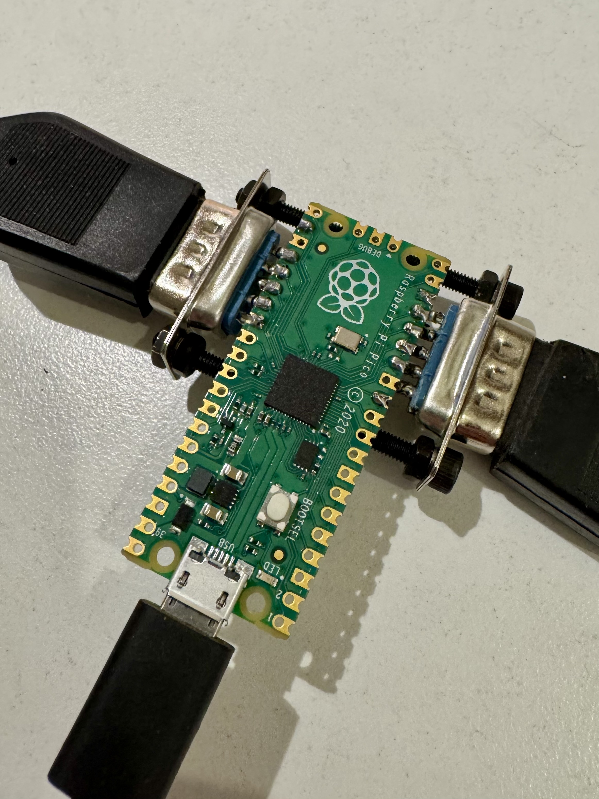
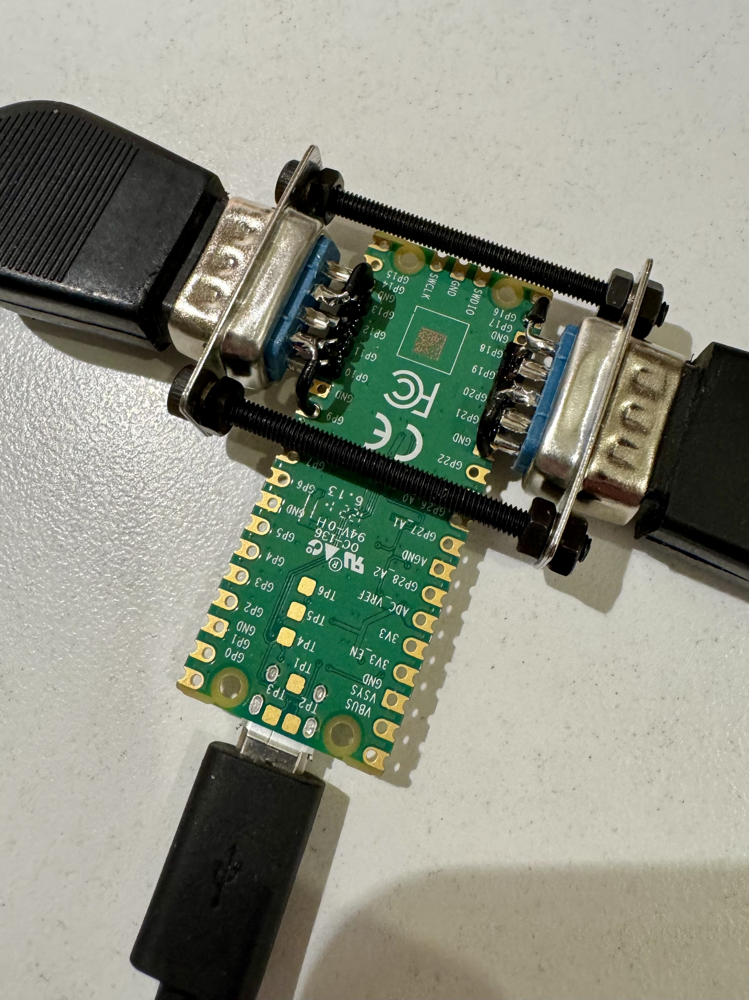

# DualJoy

This is a firmware for the Rapsberry Pi Pico that turns it into a USB adapter
for _two_ D-Sub 9 joysticks, as they where used for example with the Atari 2600
console and the Commodore C64 and Amiga home computers. They will appear as two
digital hats/d-pads with only one button.

The code is based on the various examples of the Pico SDK and TinyUSB and keeps
their MIT license.

## Usage

You can use the precompiled binary from the release page if you use the same
GPIOs as in the hardware example below:

GPIO | D-SUB pin | Function
-:|:-|:-
10 | 1 (J1) | J1 UP
11 | 2 (J1) | J1 DOWN
12 | 3 (J1) | J1 LEFT
13 | 4 (J1) | J1 RIGHT
9 | 6 (J1) | J1 BTN
18 | 1 (J2) | J2 UP
19 | 2 (J2) | J2 DOWN
20 | 3 (J2) | J2 LEFT
21 | 4 (J2) | J2 RIGHT
17 | 6 (J2) | J2 BTN

Additionally you need to connect pin 8 of both D-SUB connectors with GND on the
Pico.

## Build

If you want to use different GPIOs, you easily can build the firmware yourself.
Like any other pico project, after installing the 
[Pico SDK](https://github.com/raspberrypi/pico-sdk) you do:

```
$ mkdir build
$ cd build
$ cmake ..
$ make
```

## Simple hardware example

<p align="justify">
  
  
  &nbsp;&nbsp;&nbsp;&nbsp;&nbsp;&nbsp;&nbsp;&nbsp;&nbsp;&nbsp;
</p>
